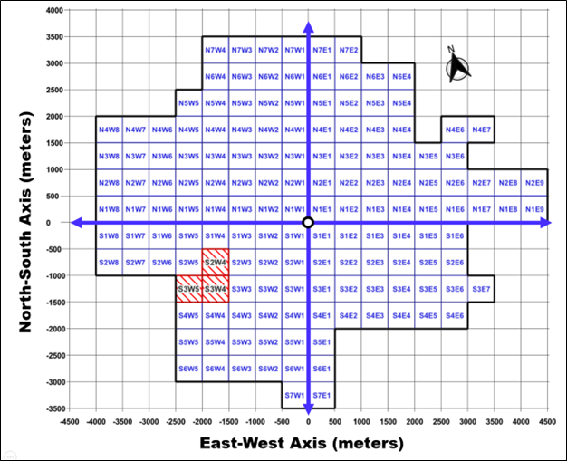
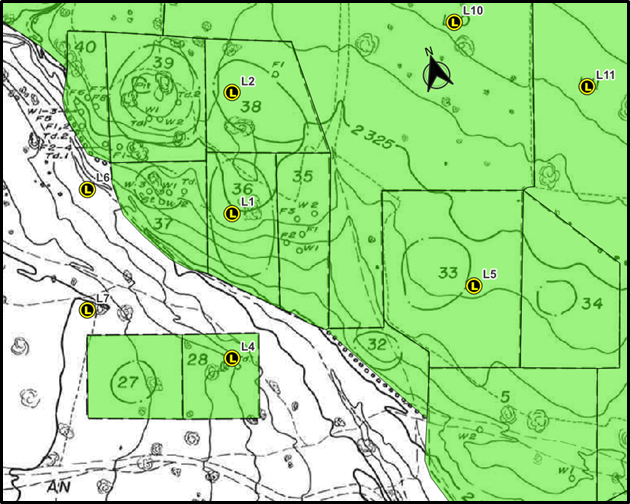
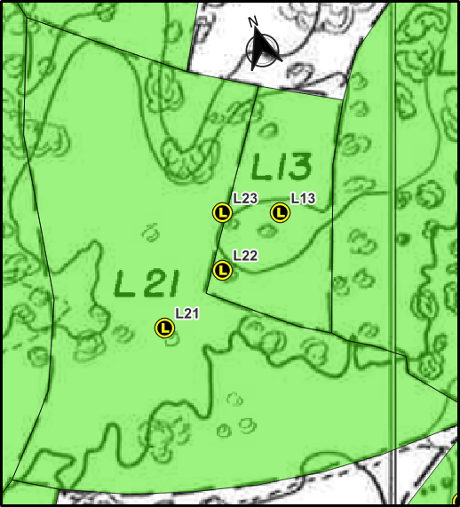
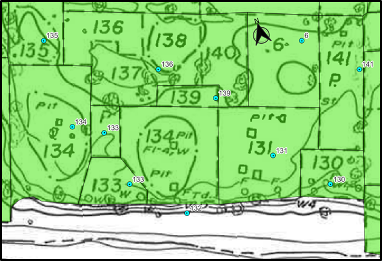
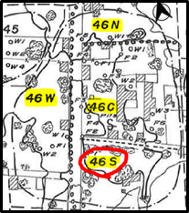
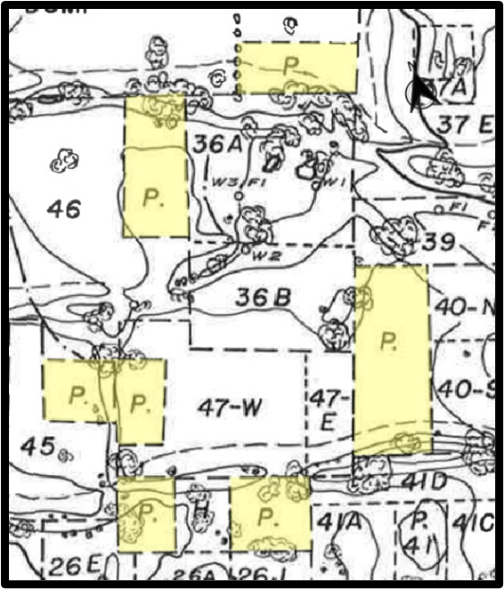
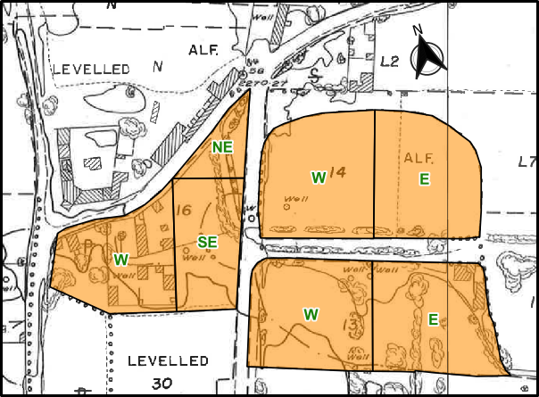

```{r rmd_setup, echo = FALSE, warning = FALSE, message = FALSE}
#rm(list = ls()) # clear workspace

# Ensure that the working directory is set to the root of the project
library(rprojroot)
knitr::opts_knit$set(root.dir = find_rstudio_root_file())
```

## Introduction

The Teotihuacan Mapping Project (TMP) was a large-scale archaeological survey of the ancient city of Teotihuacan, Mexico, conducted by René Millon and his team in the 1960s and 1970s. The project aimed to document and map the architectural and artifact remains of the city, providing a detailed record of the spatial organization and material culture of Teotihuacan. The TMP survey map, drawn by hand on a 1:1000 scale, covers an area of approximately 75 km2 and includes detailed information on the location of archaeological features such as buildings, plazas, roads, and other structures, as well as the distribution of artifacts and other material remains.

The TMP survey map is a valuable resource for researchers studying the ancient city of Teotihuacan, providing a detailed record of the archaeological remains and the spatial organization of the site. However, the digitization of the TMP map into a geospatial database has presented numerous challenges, including issues with georeferencing, vector digitization, and the integration of the spatial data with the TMP database. This document outlines the problems with the existing geospatial database of the TMP map and proposes a plan for improving the quality and usability of the data.


The geospatial database is primarily composed of the Digitization of the TMP Survey Maps from Millon (1973)

There are two maps:

1. **The Topographic Survey Map**: This corresponds to the black
2. The Architectural Reconstruction Map: This corresponds to the red overlays

Digitization of the TMP Maps in GIS includes two broad stages:

1. **Rasterization**: converting the TMP maps from Millon (1973) into raster format by arranging merging each of the individual 500 x 500 meter survey grid unit
    1. Crop the 500 x 500 meter survey grid unit scans to remove the margins/legend
    2. Arrange these according to their spatial configuration

There have been two prior GIS databases of the TMP Map undertaken by the ASU Teo Lab:

- One undertaken under the supervision of Timmothy Dennehy and Angela Huster, where the

When the database was created, an additional ID tag, the SSN number, was created numbered 1 to 5050. It is this number that Sherfield used to identify the architecture since it can easily be linked to the database.

The TMP organizational system is complex with each grid having a designation (i.e. N1W1) and each collection unit within that grid numbered 1+ leaving the designation for each collection unit: N1W1:12 for example. When the database was created, an additional ID tag, the SSN number, was created numbered 1 to 5050. It is this number that Sherfield used to identify the architecture since it can easily be linked to the database.


```{r plot_FigA1, echo = FALSE, warning = FALSE, message = FALSE}
# Display Plot

```

There are 150 grid squares (each 500 x 500 meters; 0.25 km2).


The TMP map was drawn by hand in the 1960s and 1970s by the Teotihuacan Mapping Project (TMP) team led by René Millon. The map was created by tracing low-altitude airphotos taken in the 1960s. The map was drawn on a 1:1000 scale, with each grid square representing 500 x 500 meters (0.25 km2). The map covers an area of approximately 75 km2, including the ancient city of Teotihuacan and its surrounding landscape. The map includes detailed information on the location of archaeological features such as buildings, plazas, roads, and other structures, as well as the distribution of artifacts and other material remains. The TMP map is a valuable resource for researchers studying the ancient city of Teotihuacan and its inhabitants, providing a detailed record of the archaeological remains and the spatial organization of the site.

The digitization of the TMP map into a geospatial database has presented numerous challenges, including issues with georeferencing, vector digitization, and the integration of the spatial data with the TMP database. This document outlines the problems with the existing geospatial database of the TMP map and proposes a plan for improving the quality and usability of the data.


**Georeferencing Transformation Types:**

1. **Linear Transformation:**
    - **Description:** Applies scaling and translation without rotation or shearing.
    - **Advantages:** Simple and fast; suitable for images requiring only scaling and translation.
    - **Disadvantages:** Cannot correct for rotation or distortion.
    - **Use Cases:** Ideal for images that are already aligned but need scaling or shifting.
2. **Helmert Transformation:**
    - **Description:** Performs scaling, rotation, and translation.
    - **Advantages:** Corrects for uniform scaling and rotation.
    - **Disadvantages:** Cannot handle non-uniform distortions.
    - **Use Cases:** Useful when images require rotation and scaling adjustments.
3. **Polynomial Transformations (1st, 2nd, 3rd Order):**
    - **Description:** Use polynomial equations to model complex distortions.
        - *1st Order (Affine):* Applies scaling, rotation, translation, and shearing.
        - *2nd Order:* Introduces curvature to correct moderate distortions.
        - *3rd Order:* Handles more complex, higher-degree distortions.
    - **Advantages:** Flexible; higher orders correct more complex distortions.
    - **Disadvantages:** Higher-order transformations require more control points and can overfit, leading to inaccuracies.
    - **Use Cases:** Suitable for scanned maps or aerial photos with varying degrees of distortion.
4. **Thin Plate Spline (TPS):**
    - **Description:** A non-linear transformation that minimizes bending energy, allowing local adjustments.
    - **Advantages:** Effectively corrects local distortions without affecting the entire image.
    - **Disadvantages:** Requires a substantial number of accurately placed control points; computationally intensive.
    - **Use Cases:** Ideal for historical maps or images with localized distortions.
5. **Projective Transformation:**
    - **Description:** Applies linear rotation and translation, suitable for images representing planar surfaces.
    - **Advantages:** Accurate for images of flat surfaces taken from an angle.
    - **Disadvantages:** Not suitable for images with non-planar distortions.
    - **Use Cases:** Useful for oblique aerial photographs of flat terrains.

**Resampling Methods:**

1. **Nearest Neighbor:**
    - **Description:** Assigns the value of the nearest input pixel to the output pixel.
    - **Advantages:** Fast; preserves original pixel values, making it suitable for categorical data.
    - **Disadvantages:** Can produce a blocky appearance; not ideal for continuous data.
    - **Use Cases:** Best for land cover classifications or other categorical datasets.
2. **Bilinear Interpolation:**
    - **Description:** Calculates the output pixel value as a weighted average of the four nearest input pixels.
    - **Advantages:** Produces smoother images; better for continuous data.
    - **Disadvantages:** Can blur edges; may alter original pixel values.
    - **Use Cases:** Suitable for elevation models or temperature surfaces.
3. **Cubic Convolution:**
    - **Description:** Uses 16 nearest input pixels to calculate the output pixel value, resulting in smoother images.
    - **Advantages:** Provides smoother results than bilinear interpolation; preserves more detail.
    - **Disadvantages:** More computationally intensive; can introduce artifacts in some cases.
    - **Use Cases:** Ideal for continuous data where smoothness is essential, such as satellite imagery.
4. **Cubic B-Spline:**
    - **Description:** A variant of cubic convolution that uses B-spline functions for interpolation.
    - **Advantages:** Produces very smooth images; reduces noise.
    - **Disadvantages:** Can overly smooth data, potentially obscuring details.
    - **Use Cases:** Useful for medical imaging or other applications requiring high smoothness.
5. **Lanczos Resampling:**
    - **Description:** Applies a sinc function-based interpolation over a larger kernel (e.g., 6x6).
    - **Advantages:** Produces high-quality, sharp images; reduces aliasing.
    - **Disadvantages:** Computationally intensive; may introduce ringing artifacts near edges.
    - **Use Cases:** Best for high-resolution continuous data where image quality is paramount.


## Georeferencing the TMP Map

Robertson (2015) ==

***Digital Maps of TMP Data***

In the 1990s, I digitized an electronic map of the collection tract boundaries published in Millon et al. (1973), the purpose of which was to facilitate geographic information system (GIS)-supported analyses and other computer based visualizations of TMP data. The first functional version of this file (designated MF2, for “Map File 2”) supplied the spatial information used in my dissertation research—involving GIS and computer-based analyses—into socio-spatial patterning at the level of Teotihuacan’s neighborhoods and social districts (Robertson 2001). Because I digitized each of the 147 TMP map sheets separately while creating this map, MF2 incorporated large numbers of minor errors, mostly small-scale mismatches of the edges of collection tract polygons that happened to overlap margins of individual grid squares. These kinds of errors have little or no effect on many kinds of investigations, but are incompatible with analyses in which spatial relationships are assessed by the exact contiguity of tract edges and nodes. In 2009, I created a ‘topologically clean’ version of MF2 in which (along with other minor corrections) these spatial errors have been eliminated. This most recent electronic version of the TMP collection tract map is designated MF3, and versions exist in MapInfo and ESRI shapefile formats

Other digital maps that I have created, but which I only mention in passing include a Voronoi tessellation of space around collection tract centroids derived from MF2. The polygons that compose this map are useful for spatial analyses in which it is desirable to make measurements of proximity that are unaffected by small gaps that exist at certain locations in the original TMP collection tract coverage (and as recorded in MF3). Also, I have begun digitizing the architectural interpretation sheets published in Millon et al. (1973); when completed, this map will probably be most useful for displaying or visualizing results actually generated by analyses based on MF3 or its Voronoi equivalent

## Background

Second, there is the TMP geospatial database. Perhaps the most important outcome of the TMP was the construction of the TMP survey map, which records the geospatial distribution of architectural and artifact remains across the landscape of the ancient city -- amidst a patchwork of modern agricultural and urban land use. In order to facilitate spatial analysis of the ancient city, efforts began in the late 1990s to digitize High-resolution scans of TMP’s hand-drawn field maps using GIS software linked to the TMP database. Robertson digitized the TMP’s original **500x500m sector grid** (Figure 1) into a GIS-compatible format. Each sector (e.g., N3W4) was georeferenced, enabling overlay with artifact distribution maps. Subsequently, vector layers of the survey grid, individual collection unit survey tracts, and reconstructed architectural features were progressively digitized from survey map scans by several projects between ~2000 and 2023 to facilitate spatial analysis of the database.


The TMP geospatial database is a critical resource for researchers studying the ancient city of Teotihuacan. It provides a spatial framework for analyzing the distribution of archaeological features, the organization of the city, and the relationship between different elements of the urban landscape. However, the geospatial database has several limitations and challenges that need to be addressed in order to maximize its utility for archaeological research.


### Problems with the Geospatial Data

Three different large-scale and well-funded research projects have attempted to complete GIS digitization of the TMP database, yet none of them have been able to complete the digitization up to the quality standards necessary to publish them. From the perspective of geospatial data science, the TMP GIS files are [...]


#### Georeferencing Quality

No prior attempt has been made to georeference the TMP map into a coordinate reference system

Perhaps overly preoccupied with the complexity of digitizing TMP map features and linking them to records in the TMP database, the GIS files are digitized in an arbitrary x-y coordinate plane oriented along the TMP survey grid. Amateur attempts to georeference these into a CRS have used methods inadequate for the scale and resolution of the data -- namely, linear transformations based on a few hundred ground control points along the survey grid whose true coordinates were crudely placed. However, because the TMP map was drawn via tracing low altitude airphotos, the technologically primitive ortho-rectification of these airphotos (c.1965) introduced spatially organized (systematic and random) distortion of the surface. As such, these amateur linear methods of georectification produced spatial errors as high as 150meters in outlying parts of the site. Contemporary standards of spatial accuracy in archeology are extremely high (with acceptable error under 1 meter), and given the great abundance of preserved modern and ancient features at Teotihuacan between 1965 and the present, it should be possible to reduce spatial error in georeferencing to <5m in all locations. These distortions require the use of thin-plate-spline transformations, which are dependent on a dense set of ground control points arefully placed by finding TMP map features from the 60s/70s that are still visible on the modern landscape using high-resolution satellite imagery. The scale and resolution of the TMP map thus demand 1,500-2,000 GCPs.

#### Vector Digitization Quality

Moreover, the accuracy +quality of the digitization efforts are poor even in the arbitrary x-y coordinate plane. Much of the digitization has been undertaken either by undergraduate volunteers (with highly variable vector digitization quality), and overworked grad students / post-docs eager to get a 'close enough' set of polygons that could facilitate a spatial analysis. As such, of the vector data that has been digitized from the TMP map, the vast majority requires systematic data cleaning -- digitizing features that were missed by earlier efforts, fixing polygons overlapping one another, resolving invalid geometries, snapping edges and vertices, editing sloppy polygons to conform to the lines on the map, and numerous other fixes demanded of publishable spatial data that were not done by prior projects. The combined amount of effort that this takes is roughly equivalent to starting the digitization process over from scratch.

The one high quality digitized vector layer is the architectural features by Sherfield, which were painstakingly digitized between 2019-2023. However, in her final draft of the GIS layers, Sherfield bizzarely digitized numerous architectural features in Teotihuacan's dense urban core as lines rather than as polygons because these features were not fully enclosed by walls. Structures lacking neat walls is a very common outcome of collapse and site taphonomic processes.

To be sure, reconstruction of the central zone's architecture is a complicated and difficult task given that buildings were repeatedly rebuilt and expanded atop prior architectural features over the course of the prehispanic occupation -- which subsequently collapse and degraded -- resulting in a challenging millieu of intersecting walls. Nevertheless, Millon's TMP architectural reconstructions are relatively straightforward. Sherfield did not digitize roughly half of the platforms and excavated structures of the core urban zones as structures at all -- instead leaving them as random walls. If the database is to be used to understand urban land use and the built environment of the ancient city, the architectural polygons need to be comprehensively revised in the most dense and complicated portion of the TMP map.


#### Missing Features from the TMP Map

Numerous other features on the TMP map were placed with a systematic symbology + labeling system at a high spatial resolution. These include point locations, lines and polygons of:
		- Prehispanic archtecture and artifact concentrations immediately relevant to archaeological analysis
			•	Floors
			•	Walls
			•	Talud-Tablero
			•	Plaza
			•	Pits 
			•	Mounds
			•	Staircases
			•	Stone concentrations
			•	Sherd concentrations 
			•	Obsidian concentrations
			•	The locations of Excavations
			•	Sherd dumps
		- "Modern" land use, vegetation + geomorphic features at the time of the survey that are critically important to estimating survey sampling error and archaeological recovery rates 
			•	Terraces
			•	Tepetate
			•	Drains
			•	Dams
			•	Borrow pits
			•	Jagueys, reservoirs
			•	Buildings
			•	Built-up areas
			•	Canals, rivers, barrancas
			•	Roads, railroads, power lines
			•	Alfalfa
			•	Orchards
			•	Levelled areas
			•	“Destroyed” areas
			•	"Altered" areas
			•	Eroded areas 
			•	Silted areas
			•	Areas that were Not Surveyed + No Permission
			•	Survey tracts with 'Nada' (“N”) surface artifact densities 
			•	Survey tracts with 'Almost Nada' (“AN”) surface artifact densities

Yet, for some reason, there has so-far been no attempt to digitize any of these labled features,which have critical implications for the analysis and interpretation of the city's archaeological remains. This is compounded when one considers how frequently intensive survey and excavation have demonstrated that Teo exhibits considerable spatial variability within the often very large survey units -- which make the above high-spatial-resolution map features especially valuable. 

#### Integration with the TMP Database

Only the 5050 survey tracts (SSNs) where collections were made has there been any attempt to connect the spatial database to the TMP database. Yet attaching the TMP polygons with their TMP records was for some reason never formalized. The few senior researchers who conducted spatial analysis of the TMP database apparently attached these files ad hoc, or only used collection unit centroid coordinates (rather than areal polygon topologies). Regardless, present day best practices necessitate integration of these data either as a geospatial dataset or a geospatial database (e.g. PostGIS). Regardless of the choice of format, doing this is the only way that spatial queries can be conducted to further integrate the other (undigitized) TMP spatial data -- as well as other modern geostatistical data such as high-resolution DEMs, soil data, satellite imagery, remote sensing, etc. to help bolster the data available for archaeological analysis. 


#### Classification of Architectural Features

Millon's TMP data includes separate maps for the collection units and architectural features that don't always neatly align. Although the collection unit architectural and functional interpretations directly reference (and come from) remnant evidence of architectural features, the there is not a straightforward spatial relationship between the reconstructed architecture and the survey collection units. There is not a one-to-one relationship between structures and collection units. The number of structures per collection unit ranges from 0 to >6. he architecture also routinely overlaps multiple collection units -- sometimes even splitting structures in half. While this is an understandable outcome of architectural interpretations flowing from the results of survey, the practical challenges of designing pedestrian survey tracts prior to GIS, and the necessity of controlling the spatial scale of artifact collection sampling units. **The problem here is that there is no separate data for the architectural and functional interpretations of individual structures/features.** Because there is frequently an ambiguous relationship between the collection unit and the architecture, it can be unclear how to apply the collection unit interpretation data to structures. What is the best way to classify the architectural features using the TMP database variables and additional spatial information (e.g. micro-features like walls and floors from the TMP map, as well as the spatial location, alignment and footprint of structures). Does it apply to all of them? Does the secondary interpretation actually refer to secondary structures within (or overlapping with) the sampling unit? This has troubled researchers over the last few decades wanting to analyze the architectural features in their own right (rather than the survey tracts) to analyze the urban built environment, and several teams of researchers have attempted to classify the architectural features as a semi-independent dataset. As such, any completion of the TMP geospatial database should be able to classify these features to produce an analytically useful database using systematic and reproducible methods.


## Millon Space

Sherfield made a decision

In 2020, I wrote

## GIS Layers

## Prior Problems

### Pre-Existing Spatial Data (as of September 2024)

### Architecture Vector Data

### Finalizing the Collection Unit SSN Polygons


- Many of the polygons were poorly or incorrectly digitized
    - Poor/sloppy conformance of polygon with the underlying TMP topo map
    - Polygons frequently either overlapped or there was a gap between them (when there should not have been) – sometimes resulting in invalid geometry
    - Polygons not snapped
    - Polygons frequently had invalid geometry
    - Polygons were single-part but needed to be multipart; prior digitization often crossed/included non-site areas
    - When there was a site fully enveloped by another site, this was achieved without the use of holes/rings, resulting in invalid geometry
    - Sometimes, polygons were digitized via an incorrect reading of collection unit borders from underlying TMP topo map (e.g. roads, field borders and mound borders were confused for collection unit borders)

DF9 has n = 5050 collection units, but the digitized collection unit polygons had n = 5033 polygons. Thus, n = 17 collection units lacked polygons altogether

- Of these 17 missing polygons, n = 3 were clearly labeled on the underlying TMP topo map but lacked digitized polygons

| **n** | **SSN** | **Site** | **Subsite** | **Unit** | **notes** |
| --- | --- | --- | --- | --- | --- |
| 1 | 144 | 2 | - | N4W6 |  |
| 2 | 177 | 16 | - | N3W6 |  |
| 3 | 353 | 1 | - | N5W5 |  |
- The other n = 14 (of 17) missing polygons are not labeled on the underlying TMP topo map. Instead many of their locations are indicated from the coordinates in the DF9 database

| **n** | **SSN** | **Site** | **Subsite** | **Unit** | **Notes** |
| --- | --- | --- | --- | --- | --- |
| 4 | 1243 | L1 | - | N7W2 | Spatial Merge: with Site 36:N7W2 |
| 5 | 1244 | L2 | - | N7W2 | Spatial Merge: with Site 38:N7W2 |
| 6 | 1245 | L4 | - | N7W2 | Estimate new polygon area (850 m2) |
| 7 | 1246 | L5 | - | N7W2 | Spatial Merge: with Site 33:N7W2 |
| 8 | 1247 | L6 | - | N7W2 | Estimate new polygon area (280 m2) |
| 9 | 1248 | L7 | - | N7W2 | Estimate new polygon area (2460 m2) |
| 10 | 1759 | L22 | - | N7W1 | Spatial Merge: combine N7W1 sites L13, L21, L22 and L23 |
| 11 | 1760 | L23 | - | N7W1 |  |
| 12 | 2805 | 132 | - | N2E1 | Erratum on TMP Topo Map – eastern 134:N2E1 should be 132:N2E1 |
| 13 | 3097 | 46 | T | N4E2 | Spatial Merge: with Site 46-S:N4E2 |
| 14 | 4756 | W | - | S4E3 | These four sites lack both spatial locations and data in DF9/DF10, so they should be effectively deleted |
| 15 | 4757 | X | - | S4E3 |  |
| 16 | 4758 | Y | - | S4E3 |  |
| 17 | 4759 | Z | - | S4E3 |  |
- N7W2 locations: L1, L2, L4, L5, L6, L7 (see map below)

```{r plot_FigA2, echo = FALSE, warning = FALSE, message = FALSE}
# Display Plot

```

- N7W1 locations: L22 and L23 (see map below)

```{r plot_FigA2, echo = FALSE, warning = FALSE, message = FALSE}
# Display Plot

```


- N2E1: Site 132
    - It would appear that either
        - Site 132 is the eastern of the two site 134’s on the TMP map
        - Both have estimated areas of`~1060 m2
        - The printing of 134 instead of 132 on the TMP topo map was apparently an error

```{r plot_FigA3, echo = FALSE, warning = FALSE, message = FALSE}
# Display Plot

```

N4E2: 46-T

- Merge with 46-S
- The coords in DF9 locate the site in a demonstrably incorrect location – near he ave of the dead in N4E1, with no similar site/subsite names.
- Instead, 46-T should be located very close to 46-S, en route to 46-W farther west in a clockwise progression
- This lends toward spatially merging 46-T and 46-S


```{r plot_FigA4, echo = FALSE, warning = FALSE, message = FALSE}
# Display Plot

```


S4E3: W, X, Y and Z

- These four sites lack both spatial locations and data in DF9/DF10, so they should be effectively deleted

### TMP Collection Units Lacking SSN Polygons

Numerous (n = 74) collection units on TMP topo map that lack polygons altogether

- These n = 74 collection units are IN ADDITION TO the three (n = 3) noted above… thus n=77 in total
- These cases can be subdivided into two groups:
    - Collection units with clearly identifiable provenances on the TMP topographic map, but which lack entries in the DF9 database.
    - Collection units indicated on the. TMP topographic map labeled only as ‘plazas’, and thus otherwise unassociated with any particular collection unit

#### 1. Clearly Labeled Collection Units Not Associated with a SSN

- The first set of these collection units (n = 41) are standard collection units with clearly identifiable proveniences (i.e. Unit and site, as well as subsite if applicable).
    - It seems likely that many of these should actually be merged with one of the n = 5050 collection units in DF9
    - On the other hand, they may have missing/lost collections, or be cases where no collections were taken(???)
    - Some may be identified with the 14 missing collection units specified above??
    - Need to CONSULT MERGE BOOK and other TMP metadata to determine their status!!

| **n** | **Unit** | **Site** | **Subsite** |  | **n** | **Unit** | **Site** | **Subsite** |
| --- | --- | --- | --- | --- | --- | --- | --- | --- |
| 1 | N1E2 | 20 | SE |  | 22 | N4W1 | 37 | F |
| 2 | N1E7 | L1 | - |  | 23 | N4W1 | 75 | F |
| 3 | N1W3 | 9 | SW; SE |  | 24 | N5E1 | 36 | - |
| 4 | N2E1 | 53 | - |  | 25 | N6W4 | 1 | N |
| 5 | N2E1 | 34 | - |  | 26 | N6W5 | L1 | - |
| 6 | N2E9 | L1 | - |  | 27 | N7E2 | L13 | - |
| 7 | N2E9 | L2 | - |  | 28 | N7E6 | L2 | - |
| 8 | N2W1 | 40 | C |  | 29 | N7W1 | 15 | - |
| 9 | N2W8 | L1 | - |  | 30 | N7W1 | 16 | - |
| 10 | N3W2 | 52 | - |  | 31 | N7W1 | 18 | - |
| 11 | N3W4 | 1 | - |  | 32 | N7W1 | 10 | - |
| 12 | N3W6 | L1 | - |  | 33 | N8W4 | L1 | - |
| 13 | N4E1 | 18 | G |  | 34 | N8W4 | L1 | - |
| 14 | N4E1 | 22 | M* |  | 35 | S1E2 | L9 | - |
| 15 | N4E1 | 22 | L* |  | 36 | S1W2 | 2 | NW; SW |
| 16 | N4E2 | 15 | - |  | 37 | S1W6 | 9 | S |
| 17 | N4E2 | 84 | - |  | 38 | S3E5 | 8 | - |
| 18 | N4E2 | 33 | B |  | 39 | S6W4 | 1 | - |
| 19 | N4W1 | 5 | D |  | 40 | S6W5 | L1 | - |
| 20 | N4W1 | 24 | - |  | 41 | S7E1 | L1 | - |
| 21 | N4W1 | 56 | - |  |  |  |  |  |
- Subsite also includes plaza

#### 2. Unassociated Plazas Lacking SSNs

- The second set of these collection units (n = 33) are specifically designated as plazas on the TMP topo map – indicated by sites/subsites labeled only by either “PLAZA” or “P.” (example pictured below).
    - These plazas are clustered in the areas nearer to the densely occupied areas and civic-ceremonial core of the Classic Period site.
    - For the 33 cases of unassociated plazas, it is unclear which collection unit polygons they belong to.
    - Even if no collections were not made at plaza locations, their designation as ‘plazas’ implies surface observations. As such, each plaza should (at least in theory) be associated with one of the n = 5050 collection unit polygons (DF9 SSN entries)
    - Thus, it seems likely that many of these should actually be merged with one of the n = 5050 SSN units in DF9
    - On the other hand, these may include missing data and/or lost collections, or be cases where no collections or field observations were taken(???)
    - NOTE; It should be noted that two of the cases in the first set of 41 collection units does include two cases in which plazas are designated (see table above), however these two cases also have specific subsite designations, setting them apart from those cases identified only by “PLAZA” or “P.” on the TMP topo map

```{r plot_FigA5, echo = FALSE, warning = FALSE, message = FALSE}
# Display Plot

```

- In some cases (n = 9), the spatial configuration of the plazas (relative to other sites/subsittes) clearly indicates its association with a particular site.

| **n** | **Unit** | **Site** | **Notes** |
| --- | --- | --- | --- |
| 42 | N1W1 | 15 |  |
| 43 | N1W1 | 15 |  |
| 44 | N1W1 | 15 |  |
| 45 | N3W1 | 59 |  |
| 46 | N4E1 | 20 |  |
| 47 | N4W1 | 31 |  |
| 48 | N4W1 | 25 |  |
| 49 | N4W1 | 26 |  |
| 50 | N4W1 | 47 |  |
- In another n = 24 cases, the spatial location of the plazas is between multiple of the n = 5050 collection unit polygons (DF9 SSN entries), such that their site designation is ambiguous from the TMP map alone

| **n** | **Unit** | **Site** | **Notes** |
| --- | --- | --- | --- |
| 51 | N2E1 | ? |  |
| 52 | N2E1 | ? |  |
| 53 | N3E3 | ? |  |
| 54 | N3W1 | ? |  |
| 55 | N3W1 | ? |  |
| 56 | N3W1 | 40? |  |
| 57 | N3W1 | ? |  |
| 58 | N3W2 | ? |  |
| 59 | N3W2 | ? |  |
| 60 | N3W2 | 31? 30? |  |
| 61 | N3W4 | 3? |  |
| 62 | N4E1 | ? | Also includes INAH DUMP |
| 63 | N4E1 | ? |  |
| 64 | N4W1 | 31? |  |
| 65 | N4W1 | 32? 31? |  |
| 66 | N4W1 | 32? |  |
| 67 | N4W1 | 25? 27? |  |
| 68 | N4W1 | 26? |  |
| 69 | N4W1 | 36? 46? |  |
| 70 | N4W1 | 36? 37? 57? |  |
| 71 | N4W1 | ? |  |
| 72 | N4W1 | 26? 41? 47? |  |
| 73 | N4W1 | 45? 46? |  |
| 74 | N5E1 | ? |  |

### Duplicate/Overlapping SSN Polygons

#### 1. Spatially Separable Duplicates

in many cases the subside

In many cases subsite name designations make it possible to divide certain duplicates. This is especially the case when subsite name designations include compass directions, such as when the duplicate polygons represent individual subsites ‘W’ and ‘E’.


```{r plot_FigA6, echo = FALSE, warning = FALSE, message = FALSE}
# Display Plot

```

#### 2. Problematic Duplicates

AI GEN:: "In other cases, the duplicate polygons are spatially inseparable, and thus cannot be divided into separate subsites. This is especially the case when the duplicate polygons represent individual subsites ‘N’ and ‘S’."

### SSN Merges/Aggregations

Polygon attribute table often did not indicate when a polygon aggregates multiple sites or subsites; often, only one of the sites/subsites are indicated in the attribute table

file:///C:/Users/TJ%20McMote/ASU%20Dropbox/Rudolf%20Cesaretti/TEO%20Drive/ELECTRONIC%20RESULTS/TMP_4_GLC/ssn%20concordance.pdf

### On-Site Data

### Off-Site Data

### Other (On- and Off-Site) Geographical Data on the TMP Topo Map

- Floors
- Walls
- Talud-Tablero
- Plaza
- Pits
- Mounds
- Stone concentrations
- Sherd concentrations
- Obsidian concentrations
- Excavations
- Terraces
- Tepetate
- Staircase
- Drains
- Dams
- Borrow pits
- Jagueys, reservoirs
- Reconstructed architecture
- Sherd dumps
- Buildings
- Built-up areas
- Canals, rivers, barrancas
- Roads, railroads, power lines
- Alfalfa
- Orchards
- Levelled
- “Destroyed”
- Altered
- Eroded
- Silted
- Not Surveyed + No Permission
- Survey tracts with 'Nada' (“N”) surface artifact densities
- Survey tracts with 'Almost Nada' (“AN”) surface artifact densities


## Proposed Solutions


### Georeferencing Transformation

### Vector Digitization

### Integration with the TMP Database

### Classification of Architectural Features

### Missing Features from the TMP Map

### On-Site Data

### Off-Site Data


### Other (On- and Off-Site) Geographical Data on the TMP Topo Map


